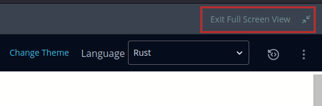
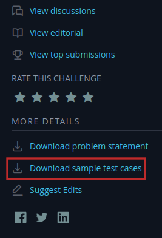

# Hacker Rank Solutions and Testing Framework

I've created this repo to track the problems I've solved and make my testing setup available to others who are still learning rust and want to do the solutions locally to make use of rust-analyzer while learning.

# Overview

A separate binary is created for each problem. They can be found in `src/bin`. Evaluation of the solution against the supplied test cases can be done by setting `tests/run_samples.rs` to point to the binary you want to test. See [setup steps](#detailed-steps) for details. It assumes the binary name matches the name of the folder with the samples (without the "-testcases" suffix). To run the problem manually use `cargo run --bin <problem_name>`. For more info see <https://doc.rust-lang.org/cargo/reference/cargo-targets.html?highlight=bin#binaries>.

# Quick steps
1. From the problem page click `Exit Full Screen View`.
2. Download the sample test files from Hacker Rank.
3. Optionally rename the downloaded file to remove any prefix.
4. Extract the downloaded files into a folder.
5. Move the folder to `tests/samples`.
6. Copy the problem name from the folder name.
7. Update the problem name in `tests/run_samples.rs`.
8. Determine the expected output of the algorithm.
9. Set type of evaluation used for problem in `tests/run_samples.rs`.
10. Create a new file in `src/bin` with the name of the problem followed by `.rs`.
11. Read problem description on website and write your solution.
12. Use `cargo test --test run_samples` to run the test cases

# Detailed Steps

Assumes you have the repo cloned locally. Uses `/` in instructions if you use Windows then use `\` as appropriate.

1. From the problem page click `Exit Full Screen View`\
  
2. Download the sample test files from Hacker Rank\
  
3. Optionally rename downloaded file to remove any prefix such as `three-month-preparation-kit-`.
4. Extract the downloaded files into a folder so that inside of that folder has 2 folders (`input` and `output`).
5. Move the folder containing `input` and `output` to `tests/samples`.
6. Copy the problem name from the folder name. It's the whole folder name less the suffix `-testcases`.
7. Update the problem name in `tests/run_samples.rs`. (Look for comment saying, `Change problem name here` near the top of the file).
8. Determine the expected output of the algorithm. Thus far I've only seen two methods, printing to stdout and writing to a file.
   - **Writing to a file**: There are two things you can look for to determine if this is what is being used.
     - A line similar to `let mut fptr = File::create(env::var("OUTPUT_PATH").unwrap()).unwrap();` near the top of main.
     - A line similar to `writeln!(&mut fptr, "{}", result).ok();` at the bottom of main.
   - **Printing to stdout**: This one is a bit more tricky but in general you can:
     - Look for the absence of the things for writing to a file.
     - Look for a line similar to `println!("{}", result.join(" "));` near the bottom of main.
     - Sometimes it's just in the question as it tells you to print your output
9. Set type of evaluation used for problem in `tests/run_samples.rs`, on the line following the name of the problem from the step above.
10. Create a new file in `src/bin` with the name of the problem followed by `.rs` eg. `countingsort1.rs` (Must match name set in `tests/run_samples.rs`).
11. Read problem description on website and write your solution.
12. Then just use `cargo test --test run_samples` to run the test cases on your solution (filtered to just `run_samples` to limit amount of junk printed to the screen).